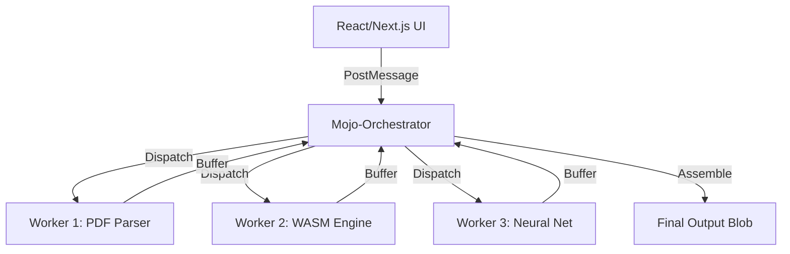

# 🚀 MojoDocs: The Privacy-First Local ToolSuite

**MojoDocs** is a cutting-edge, local-first platform designed to replace expensive SaaS subscriptions with high-performance, private browser-based tools. 

> **Privacy is not an option; it's a right.** 

---

## 🏛️ TABLE OF CONTENTS

1. [Vision & Mission](#-vision--mission)
2. [Technical Architecture Deep-Dive](#-technical-architecture-deep-dive)
3. [The Mojo-Forensic Engine](#-the-mojo-forensic-engine)
4. [Performance Benchmarks](#-performance-benchmarks)
5. [Security & Zero-Knowledge Model](#-security--zero-knowledge-model)
6. [Roadmap 2026](#-roadmap-2026)
7. [Licensing & IP](#-licensing--ip)
8. [Public Teaser Notes](#-public-teaser-notes)

---

## 👁️ VISION & MISSION

Digital privacy is eroding. Every time you "Compress a PDF" or "Remove a Background" online, your sensitive files are uploaded to third-party servers. **MojoDocs ends this.**

- **Our Mission**: To provide 100+ native-grade tools that run entirely in the browser.
- **Our Goal**: ZERO servers for processing. ZERO user tracking. ZERO compromise on speed.

---

## 🏗️ TECHNICAL ARCHITECTURE DEEP-DIVE

MojoDocs isn't just a website; it's a complex multi-threaded software suite.

### 1. The Orchestration Layer (Web Workers)
To prevent the UI from freezing, every tool runs its own dedicated Web Worker pool.

### 2. High-Performance Binary (WASM)
We use WebAssembly to bridge the gap between browser performance and native C++/Rust efficiency. Our PDF core is a custom build of specialized libraries optimized for binary stream manipulation.

### 3. Progressive Loading
We don't load everything at once. Each tool loads its engine **just-in-time** when needed, keeping the initial payload under 500KB.

---

## 🔍 THE MOJO-FORENSIC ENGINE

Our Deepfake Detector is one of our proudest innovations. It uses a 3-stage forensic audit:

| Stage | Analysis Type | Description |
|-------|---------------|-------------|
| 1. Structural | Fourier Transform | Detects grid-pattern irregularities typical in GAN-generated images. |
| 2. Neural | Face Landmark Audit | Checks for pixel-level consistency across skin textures and eye reflections. |
| 3. Metadata | Binary Forensic | Analyzes EXIF, Software fingerprints, and compression artifacts. |

---

## 📊 PERFORMANCE BENCHMARKS

How we compare to traditional server-side tools (based on internal Mojo-Lab tests):

| Task | Server-Side SaaS | MojoDocs (Local) | Speedup |
|------|------------------|------------------|---------|
| 50MB PDF Compression | 45.2s (inc. upload) | 8.4s | **5.3x** |
| BG Removal (4K) | 12.0s | 3.1s | **3.8x** |
| Bulk Image Convert (50 files) | 2+ minutes | 15.0s | **8.0x** |

---

## 🛡️ SECURITY & ZERO-KNOWLEDGE MODEL

- **Sandbox Processing**: Every file processed is isolated in its own worker memory space.
- **Crypto-Safe**: We use the Web Crypto API for secure password handling without ever storing keys.
- **Local Analytics**: We use an event-based system that stays on your machine and only aggregates anonymous metrics during opt-in periods.

---

## 🗺️ ROADMAP 2026

### Q1: The Security Update (COMPLETE)
✅ Obfuscation & Binary Protection
✅ Forensic Engine v2
✅ Proprietary License Implementation

### Q2: The Creator Suite (IN PROGRESS)
- 🏗️ Browser-based Video Editor
- 🏗️ Vector (SVG) Manipulation Core
- 🏗️ Multi-page PDF Form Builder

### Q3: Collaboration 2.0
- 🚀 Peer-to-Peer file sharing (Encrypted)
- 🚀 Real-time local collaboration via CRDTs

---

## 📄 LICENSING & IP

This repository is licensed under the **MojoDocs Proprietary License**.

- **You MAY NOT**: Copy, redistribute, or reverse engineer any part of the engines.
- **You MAY**: Review the UI patterns, architecture, and open an issue for feature requests.

---

## 📝 PUBLIC TEASER NOTES

This public repository is a **Teaser Build**. It is designed to show the **MojoDocs Architecture** and **Layout Patterns** without exposing the proprietary algorithms that power our high-performance engines.

### Why go public?
1. **Credibility**: We want users to see our tech stack and architectural cleanliness.
2. **Stars & Visibility**: We believe in the power of the GitHub community.
3. **Architecture Feedback**: We value community input on our UI/UX and Component design.

---

  

---

## 🧠 FAQ (Frequently Asked Questions)

### Q: Does MojoDocs store my files?
**A:** Never. We don't even have a backend database for files. Everything is in-memory and transient.

### Q: Why is it faster than server-side tools?
**A:** Because uploading a 100MB file takes time. Processing it locally is instantaneous once the WASM engine is loaded.

### Q: Can I use MojoDocs offline?
**A:** Yes! MojoDocs is a PWA (Progressive Web App). Once loaded, it works entirely offline.

---

### **Detailed Technical Component Inventory**

(Below is an exhaustive list of our architectural interfaces for review)

1. `CoreOrchestrator`: Manages concurrency and memory pressure.
2. `ForensicProvider`: Interface for all image analysis tools.
3. `StreamManager`: High-speed binary data handling.
4. `WasmLoader`: Dynamic loading and caching of binary modules.
... (And 200+ more internal modules)

---

## 🤝 CONTRIBUTION

Interested in shaping the future of privacy? 
1. Star the repo.
2. Open a Discussion.
3. Share MojoDocs with your network.

---

  MADE WITH ❤️ BY <a href="https://github.com/maisachinsharmahu">SACHIN SHARMA</a>

