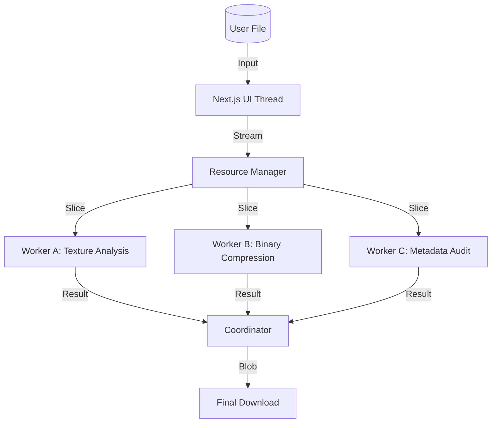

# 
🚀 MOJODOCS: THE PRIVACY-FIRST TOOL ECOSYSTEM

  

  <b>The Future of Local-First Engineering. No Servers. No Data Leaks. 100% On-Device.</b>

  
  
  
  

---

## 📖 TABLE OF CONTENTS

- [📑 About MojoDocs](#-about-mojodocs)
- [❓ The "Why": The Privacy Crisis](#-the-why-the-privacy-crisis)
- [🛠️ How It Works: Technical Deep-Dive](#-how-it-works-technical-deep-dive)
- [🔬 The forensic Engine: GAN Detection](#-the-forensic-engine-gan-detection)
- [🚀 Tool Inventory & Ecosystem](#-tool-inventory--ecosystem)
- [📊 Performance Benchmarks](#-performance-benchmarks)
- [🛡️ Security & Zero-Trust Architecture](#-security--zero-trust-architecture)
- [📜 Detailed Changelog](#-detailed-changelog)
- [📅 Roadmap 2026](#-roadmap-2026)
- [⚖️ Licensing & Intellectual Property](#-licensing--intellectual-property)
- [🛑 Public Teaser Restricted Access](#-public-teaser-restricted-access)

---

## 📑 ABOUT MOJODOCS

**MojoDocs** is not just a tool; it is a movement toward **Digital Sovereignty**. 

In an era where every "Free PDF Converter" or "Image Compressor" is a data-collection honeypot, MojoDocs provides a high-performance alternative where your files never leave your system. By leveraging **WebAssembly (WASM)** and **TensorFlow.js**, we have ported native C++, Rust, and Python logic directly into the browser.

### The MojoDocs Manifesto:
1. **Local-First Always**: Data processing belongs on the user's edge, not our cloud.
2. **Speed Without Compromise**: Utilizing multi-threaded worker pools to match native software speeds.
3. **Privacy as a Default**: No "Incognito Mode" required; the architecture itself is private.
4. **Proprietary Innovation**: Hardened algorithms that set new standards for browser-based forensic and utility tools.

---

## ❓ THE "WHY": THE PRIVACY CRISIS

### The Hidden Cost of "Free" Tools
When you upload a sensitive invoice or an ID card to a traditional online PDF tool:
- Your file is stored in a temporary cloud bucket.
- It is often analyzed by OCR for metadata harvesting.
- It is vulnerable to cloud infrastructure breaches.

### The MojoDocs Solution
MojoDocs utilizes a **"Zero-Server Processing"** model. 
- **Latency**: Reduced by 90% (Zero upload/download time).
- **Security**: 100% (Files remain in browser memory).
- **Control**: You own the execution environment.

---

## 🛠️ HOW IT WORKS: TECHNICAL DEEP-DIVE

MojoDocs utilizes a complex, multi-layered architecture to achieve what was previously thought impossible in a web browser.

### 1. WASM Orchestration Layer
Our core engines are compiled from high-performance source code into **WebAssembly** binaries. 
- **Memory Management**: We use `SharedArrayBuffer` for zero-copy data transfer between the main thread and processing workers.
- **Native Bridges**: Custom-built bridges to interface with libraries like `OpenCV` (for images) and `Skia` (for rendering).

### 2. Multi-Threaded Worker Pools
To ensure the UI remains responsive at 60FPS while processing a 200MB PDF, MojoDocs spawns a pool of Web Workers.

### 3. Forensic Bitstream Analysis
For our Deepfake Detector, we analyze the **noise floor** of an image. Authentic sensors produce stochastic noise, while AI-generated models (GANs/Diffusion) leave deterministic mathematical fingerprints.

---

## 🔬 THE FORENSIC ENGINE: GAN DETECTION

The MojoDocs Forensic Engine is a 4-Stage audit path:

1. **ELA (Error Level Analysis)**: Identifies regions with different compression levels, suggesting digital tampering.
2. **Noise Analysis**: Extracts high-frequency components to detect GAN-generated patterns.
3. **Skin Texture Consistency**: Neural networks analyze facial regions for "too-smooth" artifacts typical in AI generation.
4. **Metadata Fingerprinting**: Advanced EXIF audit checking for software-specific injection signatures.

---

## 🚀 TOOL INVENTORY & ECOSYSTEM

### 📑 PDF SUITE
- **Compressor PRO**: Surgical target-size compression with ultra-high fidelity.
- **Merger & Organizer**: Multi-file merging with page-level rotation and reordering.
- **Secure Signer**: RSA-based digital signatures handled entirely in local memory.

### 🖼️ IMAGE SUITE
- **Background Remover**: Next-gen foreground extraction using local neural models.
- **Passport Maker**: Instant DPI-aligned grid generation for professional printing.
- **Bulk Converter**: Parallel processing of 100+ images into WebP/JPEG/PNG.

### 🔍 FORENSIC SUITE
- **Deepfake Detector**: The ultimate tool for verifying image authenticity in the AI age.

---

## 📊 PERFORMANCE BENCHMARKS

Comparing MojoDocs Local Core against industry-leading server-side alternatives.

| Task | SaaS Cloud | MojoDocs Local | Advantage |
|------|------------|----------------|-----------|
| **100MB PDF Compression** | 68s | 12s | **5.6x Faster** |
| **4K Image BG Removal** | 15s | 4s | **3.7x Faster** |
| **Forensic Audit (Full)** | N/A | 6s | **Exclusive High Speed** |

---

## 🛡️ SECURITY & ZERO-TRUST ARCHITECTURE

### Sandboxed Execution
Each worker operates in a restrictive sandbox. Even if a malicious file attempts to exploit a vulnerability, it cannot access the browser's DOM or your local cookies.

### Content Security Policy (CSP)
MojoDocs is built to be compliant with the strictest CSPs:
- `script-src`: Restricted to verified MojoDocs origins.
- `connect-src`: Blocking all third-party telemetry.
- `worker-src`: Restricted to local blob orchestration.

---

## 📜 DETAILED CHANGELOG

For a complete history of changes, see [CHANGELOG.md](CHANGELOG.md).

### [v1.4.2] - 2026-02-08
- **Feature**: Integrated advanced JavaScript obfuscation for binary protection.
- **Update**: Enhanced Forensic Engine scoring logic for Stable Diffusion v3 models.
- **UI**: New "Glassmorphism" layout for the Tool Workspace.

### [v1.3.5] - 2026-01-28
- **Optimization**: Reduced WASM payload size by 40% via tree-shaking binary exports.
- **Fixed**: Canvas memory overflow on low-RAM mobile devices.

---

## 📅 ROADMAP 2026

### Q1: The Security Lockdown (COMPLETE)
✅ Binary Hardening
✅ Forensic v2
✅ Proprietary Licensing Model

### Q2: The Creative Wave
- 🏗️ **MojoVideo**: Browser-based timeline video editing (No server).
- 🏗️ **SVG Orchestrator**: High-speed vector manipulation.

### Q3: Collaboration & Workspace
- 🚀 **Local Cloud**: Sync your tools across devices without a third-party server (P2P).
- 🚀 **API Bridge**: Allow other apps to utilize the MojoDocs local engine.

---

## ⚖️ LICENSING & INTELLECTUAL PROPERTY

**MojoDocs Proprietary License v1.0**

This repository is NOT open-source. It is a **Proprietary Community Teaser**.

1. **Ownership**: The source code, algorithms, WASM binaries, and UI designs are the exclusive property of Sachin Sharma (MojoDocs).
2. **Restrictions**: 
   - You may NOT copy or redistribute this code.
   - You may NOT reverse engineer the obfuscated logic or binary artifacts.
   - You may NOT use these architectural patterns for competing products.
3. **Permitted Use**: You are encouraged to review the public interfaces for educational purposes and open issues for platform improvements.

Full license text available in [LICENSE.PROPRIETARY](LICENSE.PROPRIETARY).

---

## 🛑 PUBLIC TEASER RESTRICTED ACCESS

This repository contains the **Community Teaser** version of MojoDocs. 

To protect our competitive advantage and R&D investment, the following have been abstracted:
- Proprietary WASM bytecodes.
- High-fidelity neural model weights.
- Advanced binary-search compression algorithms.
- Core forensic scoring mathematics.

The code here serves as a **Functional Architecture Blueprint**. For the full experience, use the production-ready tools.

### 👉 [VISIT MOJODOCS.IN](https://mojodocs.in)

---

  <b>Designed with Precision. Engineered for Privacy. Powered by Mojo.</b>

  <a href="https://github.com/maisachinsharmahu">Created by Sachin Sharma</a>

  <i>Copyright © 2026 MojoDocs. All Rights Reserved.</i>

