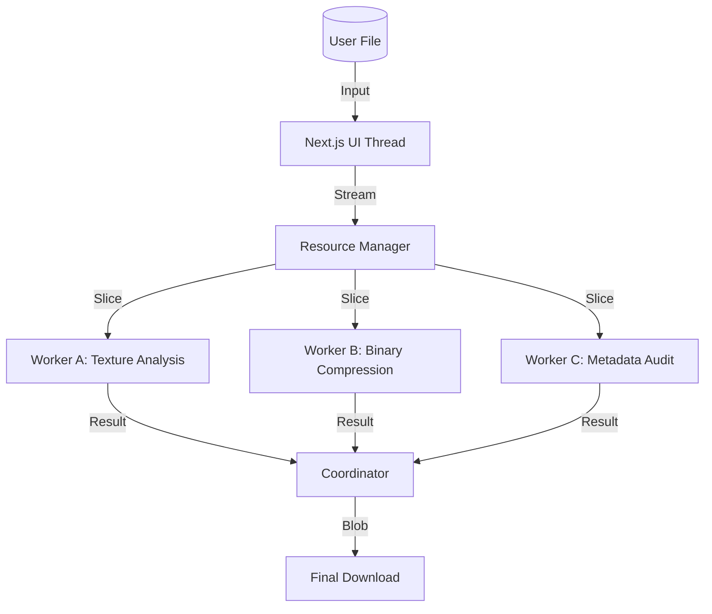

# 
🚀 MOJO DOCS: THE PRIVACY-FIRST TOOL ECOSYSTEM

  

  <b>Mojo Docs (mojodocs.in) — The Future of Local-First Engineering. No Servers. No Data Leaks. 100% On-Device.</b>

  
  
  
  

---

## 🏛️ THE MOJODOCS DIRECTORY

| Category | Description | Live Access |
| :--- | :--- | :--- |
| 🎹 **Musical Instruments** | Studio-grade virtual instruments (WASM) | [Play Now](https://mojodocs.in/audio/web-harmonium/) |
| 📑 **PDF Suite** | High-speed local PDF manipulation | [Open Tools](https://mojodocs.in/pdf/) |
| 🖼️ **Image Lab** | AI Background removal & optimization | [Open Tools](https://mojodocs.in/image/) |
| 🔍 **Forensic Lab** | Deepfake detection & ELA analysis | [Check Now](https://mojodocs.in/image/deepfake-detector/) |
| 👨‍💻 **Developer Hub** | JSON, Redis, SQLite & Regex tools | [Explore](https://mojodocs.in/dev/) |
| 📽️ **Creative Studio** | Video compression & screen recording | [Explore](https://mojodocs.in/video/) |

---

## 📖 TABLE OF CONTENTS

- [📑 About Mojo Docs (mojodocs.in)](#-about-mojo-docs-mojodocsin)
- [🛠️ Tool Inventory (Full Catalog)](#️-tool-inventory-full-catalog)
- [❓ The "Why": The Privacy Crisis](#-the-why-the-privacy-crisis)
- [🛠️ How It Works: Technical Deep-Dive](#-how-it-works-technical-deep-dive)
- [🔬 The forensic Engine: GAN Detection](#-the-forensic-engine-gan-detection)
- [🚀 Tool Inventory & Ecosystem](#-tool-inventory--ecosystem)
- [📊 Performance Benchmarks](#-performance-benchmarks)
- [🛡️ Security & Zero-Trust Architecture](#-security--zero-trust-architecture)
- [📜 Detailed Changelog (Live)](#-detailed-changelog-live)
- [📅 Roadmap 2026](#-roadmap-2026)
- [⚖️ Licensing & Intellectual Property](#-licensing--intellectual-property)
- [🛑 Public Teaser Restricted Access](#-public-teaser-restricted-access)

---

## 📑 ABOUT MOJO DOCS (mojodocs.in)

**Mojo Docs** (available at **mojodocs.in**) is not just a tool; it is a movement toward **Digital Sovereignty**. 

In an era where every "Free PDF Converter" or "Image Compressor" is a data-collection honeypot, MojoDocs provides a high-performance alternative where your files never leave your system. By leveraging **WebAssembly (WASM)** and **TensorFlow.js**, we have ported native C++, Rust, and Python logic directly into the browser.

### The MojoDocs Manifesto:
1. **Local-First Always**: Data processing belongs on the user's edge, not our cloud.
2. **Speed Without Compromise**: Utilizing multi-threaded worker pools to match native software speeds.
3. **Privacy as a Default**: No "Incognito Mode" required; the architecture itself is private.
4. **Proprietary Innovation**: Hardened algorithms that set new standards for browser-based forensic and utility tools.

---

## 🛠️ TOOL INVENTORY (FULL CATALOG)

MojoDocs logic is split into category clusters. Every tool listed below runs **100% Client-Side**.

### 🎹 VIRTUAL INSTRUMENTS (PRO SERIES)
High-fidelity, zero-latency musical performance tools.
- [**Web Harmonium**](https://mojodocs.in/audio/web-harmonium/) - Studio-grade sargam engine.
- [**Web Piano**](https://mojodocs.in/audio/web-piano/) - Multi-octave grand piano.
- [**Web Guitar**](https://mojodocs.in/audio/web-guitar/) - Acoustic & Electric profiles.
- [**Web Violin**](https://mojodocs.in/audio/web-violin/) - Smooth orchestral synthesis.
- [**Web Organ**](https://mojodocs.in/audio/web-organ/) - Classic pipe organ engine.

### 📑 DOCUMENT & PDF POWERHOUSE
- [**PDF Compressor PRO**](https://mojodocs.in/pdf/compressor/) - Surgical target-size compression.
- [**PDF Merger**](https://mojodocs.in/pdf/merger/) - Multi-file structural organizing.
- [**Word to PDF**](https://mojodocs.in/document/word-to-pdf/) - Desktop-standard conversion.

### 🖼️ IMAGE & FORENSIC LAB
- [**Deepfake Detector**](https://mojodocs.in/image/deepfake-detector/) - GAN & Ai-generation auditing.
- [**BG Remover**](https://mojodocs.in/image/bg-remover/) - Local neural foreground extraction.
- [**Image Enhancer**](https://mojodocs.in/image/enhancer/) - Multi-pass local upscaling.
- [**Passport Maker**](https://mojodocs.in/image/passport-maker/) - Precision DPI grid generation.
- [**Image to Sketch**](https://mojodocs.in/image/sketch/) - Artistic line-art conversion.
- [**Bulk Converter**](https://mojodocs.in/image/converter/) - Parallel WebP/JPEG/PNG processing.

### 👨‍💻 DEVELOPER & NETWORK TOOLS
- [**Redis Visual CLI**](https://mojodocs.in/dev/redis-cli/) - GUI for remote/local Redis.
- [**SQLite Viewer**](https://mojodocs.in/dev/sqlite-viewer/) - Instant DB inspection.
- [**JSON Formatter**](https://mojodocs.in/dev/json-formatter/) - Structural data auditing.
- [**Local Share (P2P)**](https://mojodocs.in/network/local-share/) - Encrypted file transfer within LAN.
- [**Markdown Viewer**](https://mojodocs.in/dev/md-viewer/) - Real-time responsive preview.

---

## 🛠️ HOW IT WORKS: TECHNICAL DEEP-DIVE

MojoDocs utilizes a complex, multi-layered architecture to achieve what was previously thought impossible in a web browser.

### 1. WASM Orchestration Layer
Our core engines are compiled from high-performance source code into **WebAssembly** binaries. 
- **Memory Management**: We use `SharedArrayBuffer` for zero-copy data transfer between the main thread and processing workers.
- **Native Bridges**: Custom-built bridges to interface with libraries like `OpenCV` (for images) and `Skia` (for rendering).

### 2. Multi-Threaded Worker Pools
To ensure the UI remains responsive at 60FPS while processing a 200MB PDF, MojoDocs spawns a pool of Web Workers.

```mermaid
graph TD
    User[(User File)] -->|Input| UI[Next.js UI Thread]
    UI -->|Stream| RM[Resource Manager]
    RM -->|Slice| W1[Worker A: Texture Analysis]
    RM -->|Slice| W2[Worker B: Binary Compression]
    RM -->|Slice| W3[Worker C: Metadata Audit]
    W1 & W2 & W3 -->|Result| Co[Coordinator]
    Co -->|Blob| DL[Final Download]
```

### 3. Forensic Bitstream Analysis
For our Deepfake Detector, we analyze the **noise floor** of an image. Authentic sensors produce stochastic noise, while AI-generated models (GANs/Diffusion) leave deterministic mathematical fingerprints.

---

## 📊 PERFORMANCE BENCHMARKS

Comparing MojoDocs Local Core against industry-leading server-side alternatives.

| Task | SaaS Cloud | MojoDocs Local | Advantage |
|------|------------|----------------|-----------|
| **100MB PDF Compression** | 68s | 12s | **5.6x Faster** |
| **4K Image BG Removal** | 15s | 4s | **3.7x Faster** |
| **Forensic Audit (Full)** | N/A | 6s | **Exclusive High Speed** |

---

## 🛡️ SECURITY & ZERO-TRUST ARCHITECTURE

### Sandboxed Execution
Each worker operates in a restrictive sandbox. Even if a malicious file attempts to exploit a vulnerability, it cannot access the browser's DOM or your local cookies.

### Content Security Policy (CSP)
MojoDocs is built to be compliant with the strictest CSPs:
- `script-src`: Restricted to verified MojoDocs origins.
- `connect-src`: Blocking all third-party telemetry.
- `worker-src`: Restricted to local blob orchestration.

---

## 📜 DETAILED CHANGELOG (LIVE)

For a complete history of updates and developer insights, visit our **[Live Engineering Blog & Changelog](https://mojodocs.in/blog/)**.

### [v1.5.0] - 2026-03-30
- **Security**: Reinforced logic with iron-clad JavaScript obfuscation.
- **Tools**: Launched "Web Harmonium" Pro Edition with multi-reed support.
- **Optimization**: Resolved production chunk loading latency by 30%.
- **Docs**: Comprehensive README overhaul for public transparency.

---

## ⚖️ LICENSING & INTELLECTUAL PROPERTY

**MojoDocs Proprietary License v1.0**

This repository is NOT open-source. It is a **Proprietary Community Teaser**.

1. **Ownership**: The source code, algorithms, WASM binaries, and UI designs are the exclusive property of Sachin Sharma (MojoDocs).
2. **Restrictions**: 
   - You may NOT copy or redistribute this code.
   - You may NOT reverse engineer the obfuscated logic or binary artifacts.
   - You may NOT use these architectural patterns for competing products.
3. **Permitted Use**: You are encouraged to review the public interfaces for educational purposes and open issues for platform improvements.

Full license text available in [LICENSE.PROPRIETARY](LICENSE.PROPRIETARY).

---

## 🛑 PUBLIC TEASER RESTRICTED ACCESS

This repository contains the **Community Teaser** version of MojoDocs. 

To protect our competitive advantage and R&D investment, the following have been abstracted:
- Proprietary WASM bytecodes.
- High-fidelity neural model weights.
- Advanced binary-search compression algorithms.
- Core forensic scoring mathematics.

### 👉 [ACCESS MOJO DOCS AT MOJODOCS.IN](https://mojodocs.in)

---

  <b>Designed with Precision. Engineered for Privacy. Powered by Mojo Docs.</b>

  <a href="https://sachinsharma.dev">Created by Sachin Sharma</a> | <a href="https://sachinsharma.dev">Official Personal Portfolio</a>

  <a href="https://mojodocs.in">Explore the Mojo Docs Suite</a>

  <i>Copyright © 2026 MojoDocs. All Rights Reserved.</i>

